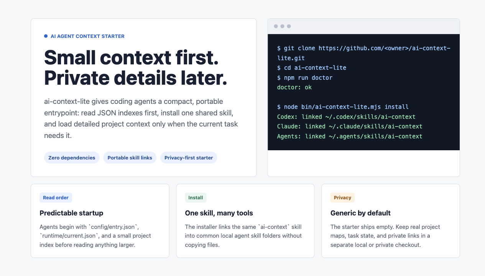

# ai-context-lite

`ai-context-lite` is a minimal, portable context entry for AI coding agents.



It gives tools like Codex, Claude Code, and similar local agents a small first
place to read before they load large documents, private notes, or project
details.

## What This Tool Does

- Provides one small JSON entrypoint: `config/entry.json`.
- Provides a minimal agent skill: `skill/ai-context/SKILL.md`.
- Installs that skill into common local skill folders.
- Keeps project routing data in JSON so an agent can load only the context that
  matches the current task.
- Starts empty and generic, so you can add your own private project map later.

## Why It Is Useful

AI coding sessions often become noisy when every conversation starts by reading
too many Markdown files, old notes, or unrelated project documents.

`ai-context-lite` keeps the default load path small:

1. Read the repository entry JSON.
2. Read the current runtime pointer.
3. Read the project index.
4. Load detailed context only after a project or task is selected.

This makes agent behavior easier to understand, easier to move between
machines, and safer to share as a starter template.

## Privacy Boundary

This repository is intentionally generic. Do not put personal identity,
machine-specific absolute paths, private project names, credentials, ticket
links, or workspace URLs in it.

Keep real project data in a private checkout or local-only files.

## Requirements

- Node.js 18 or newer
- macOS, Linux, or Windows with symlink support

No npm dependencies are required.

## Install From GitHub

```bash
git clone https://github.com/<owner>/ai-context-lite.git
cd ai-context-lite
npm install
npm run doctor
node bin/ai-context-lite.mjs install
```

After install, the same skill source is linked into these locations when they
exist or can be created:

```text
~/.codex/skills/ai-context
~/.claude/skills/ai-context
~/.agents/skills/ai-context
```

## Local Development

```bash
npm test
npm run doctor
npm run check
```

Useful direct commands:

```bash
node bin/ai-context-lite.mjs doctor
node bin/ai-context-lite.mjs check
node bin/ai-context-lite.mjs install --dry-run
node bin/ai-context-lite.mjs install
node bin/ai-context-lite.mjs uninstall --dry-run
node bin/ai-context-lite.mjs uninstall
```

## File Layout

```text
bin/ai-context-lite.mjs       CLI for doctor, check, install, and uninstall
config/entry.json             Portable read order and privacy boundary
config/projects/index.json    Empty project index for users to extend
docs/intro-panel.html         Static introduction panel used for screenshots
docs/intro-panel.png          Screenshot for README and repo previews
runtime/current.json          Empty current task pointer
skill/ai-context/SKILL.md     Minimal skill loaded by AI coding agents
test/cli.test.mjs             Node test coverage for the CLI and privacy scan
```

## How To Extend It

Add project-specific files privately first:

```text
config/projects/my-project.json
config/projects/index.json
runtime/current.json
```

Keep `config/projects/index.json` as the small routing list. Put detailed,
private project notes somewhere that is not committed to a public starter repo.

## License

MIT
