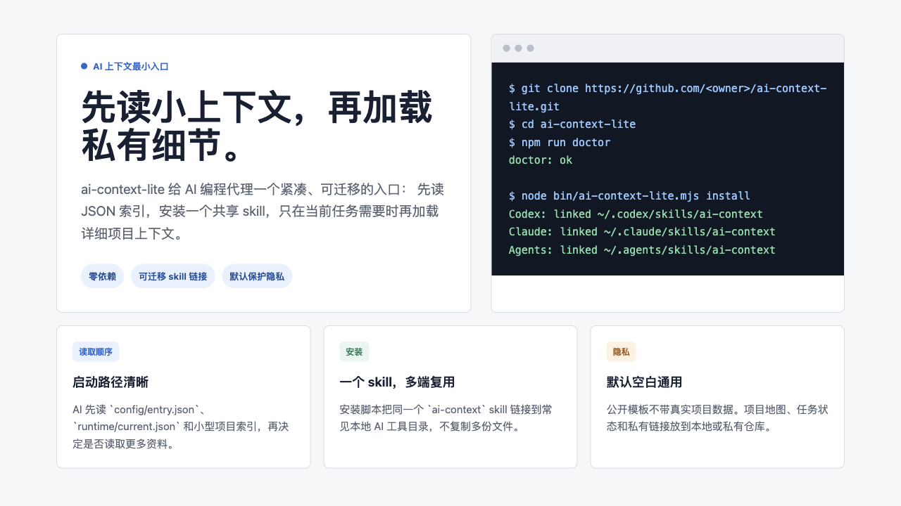
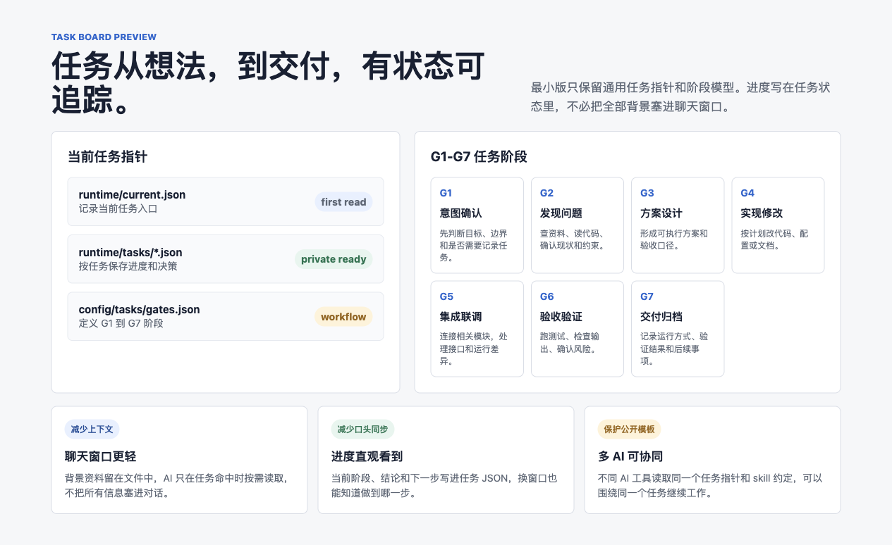
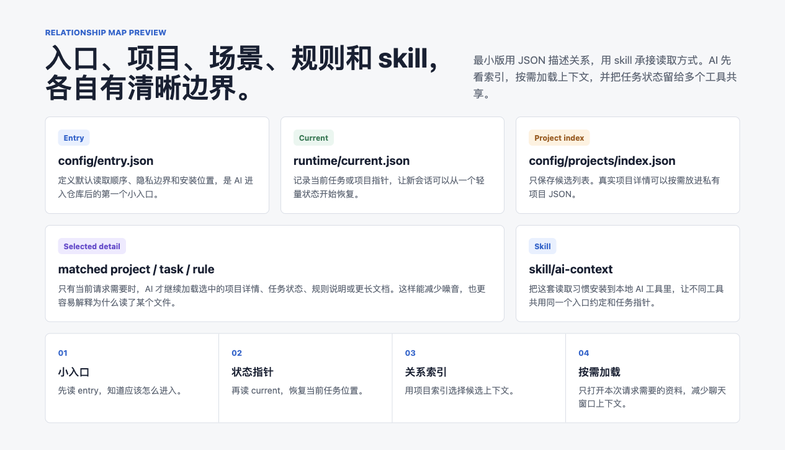

# ai-context-lite

[English](README.md) | [简体中文](README.zh-CN.md)

`ai-context-lite` 是一个给 AI 编程代理使用的最小上下文入口。



它的目标很简单：让 Codex、Claude Code 这类本地 AI 工具先读取一组很小的 JSON 索引，再按当前任务需要加载更详细的项目资料。这样可以减少无关上下文，也更方便在不同电脑之间迁移。

## 这个工具是干嘛的

- 提供一个轻量总入口：`config/entry.json`。
- 提供一个最小 AI skill：`skill/ai-context/SKILL.md`。
- 把这个 skill 安装到常见本地 skill 目录。
- 用 JSON 记录项目路由信息，让 AI 只加载当前任务真正需要的上下文。
- 默认不带任何真实项目数据，方便作为公开模板使用。

## 有什么用

AI 编程会话如果一开始就读取大量 Markdown、旧笔记、项目文档，很容易变得慢、乱、不稳定。

`ai-context-lite` 把默认读取链路收窄成：

1. 读取仓库入口 JSON。
2. 读取当前任务指针。
3. 读取项目索引。
4. 只有选中项目或任务之后，才加载更详细的上下文。

这样做的好处是：

- 聊天窗口不需要长期塞入大量背景资料。
- 上下文按需加载，只有命中任务时才读取详细文件。
- 新会话更容易恢复上下文。
- AI 的读取路径更清晰。
- 任务进度可以通过任务状态文件直观看到。
- 可以让不同 AI 工具围绕同一个任务状态协作。
- 不同电脑安装时更容易保持一致。
- 公开仓库里不会默认夹带私有项目资料。

## 面板预览

任务面板展示从意图确认到交付归档的阶段，以及当前任务指针应该放在哪里。



关系面板展示入口、当前状态、项目索引、详细上下文和 skill 的读取关系。



## 隐私边界

这个仓库故意保持通用。不要把个人身份、本机绝对路径、私有项目名、账号密钥、工单链接或工作区 URL 写进公开仓库。

真实项目地图、任务状态、私有链接和业务说明，建议放在私有仓库或本地不提交的文件里。

## 环境要求

- Node.js 18 或更新版本
- macOS、Linux，或支持符号链接的 Windows 环境

这个最小版不依赖任何 npm 包。

## 从 GitHub 安装

```bash
git clone https://github.com/<owner>/ai-context-lite.git
cd ai-context-lite
npm install
npm run doctor
node bin/ai-context-lite.mjs install
```

安装后，同一个 skill 源目录会被链接到这些位置：

```text
~/.codex/skills/ai-context
~/.claude/skills/ai-context
~/.agents/skills/ai-context
```

## 本地开发

```bash
npm test
npm run doctor
npm run check
```

常用命令：

```bash
node bin/ai-context-lite.mjs doctor
node bin/ai-context-lite.mjs check
node bin/ai-context-lite.mjs install --dry-run
node bin/ai-context-lite.mjs install
node bin/ai-context-lite.mjs uninstall --dry-run
node bin/ai-context-lite.mjs uninstall
```

## 文件结构

```text
bin/ai-context-lite.mjs          CLI，负责 doctor、check、install、uninstall
config/entry.json                可迁移读取顺序和隐私边界
config/projects/index.json       空项目索引，给使用者后续扩展
docs/intro-panel.html            英文介绍面板
docs/intro-panel.png             英文介绍截图
docs/intro-panel.zh-CN.html      中文介绍面板
docs/intro-panel.zh-CN.png       中文介绍截图
docs/task-flow-panel.zh-CN.html  中文任务面板
docs/task-flow-panel.zh-CN.png   中文任务面板截图
docs/relationship-panel.zh-CN.html 中文关系面板
docs/relationship-panel.zh-CN.png  中文关系面板截图
runtime/current.json             空当前任务指针
skill/ai-context/SKILL.md        AI 编程代理读取的最小 skill
test/cli.test.mjs                CLI 和隐私扫描测试
```

## 怎么扩展

建议先在私有环境里加自己的项目配置：

```text
config/projects/my-project.json
config/projects/index.json
runtime/current.json
```

`config/projects/index.json` 只保留轻量路由列表。详细项目笔记、业务资料和私有链接不要提交到公开模板仓库。

## 开源协议

MIT
