# Scene Repo Bundle Overview

> 自动生成于 `2026-04-05T14:19:31.682Z`。用于快速查看 `scene -> repo -> bundle` 的默认装配关系。

## 总览

- repos: `33`
- scenes: `7`
- bundles: `37`

## Scene Graph

```mermaid
flowchart LR
  scene_index_h5_webview["index-h5-webview"]
  repo_dhb["dhb"]
  scene_index_h5_webview --> repo_dhb
  repo_dhb_mobile_index["dhb-mobile-index"]
  scene_index_h5_webview --> repo_dhb_mobile_index
  repo_new_mobile_h5["new-mobile-h5"]
  scene_index_h5_webview --> repo_new_mobile_h5
  scene_cash_index_h5_webview["cash-index-h5-webview"]
  scene_cash_index_h5_webview --> repo_dhb
  scene_cash_index_h5_webview --> repo_dhb_mobile_index
  repo_dhbfront_cash_mini["dhbfront-cash-mini"]
  scene_cash_index_h5_webview --> repo_dhbfront_cash_mini
  scene_cash_index_h5_webview --> repo_new_mobile_h5
  scene_packages_cash_index_h5_webview["packages-cash-index-h5-webview"]
  repo_customize_mini_program["customize-mini-program"]
  scene_packages_cash_index_h5_webview --> repo_customize_mini_program
  scene_packages_cash_index_h5_webview --> repo_dhb
  scene_packages_cash_index_h5_webview --> repo_dhb_mobile_index
  repo_dhb_packages["dhb-packages"]
  scene_packages_cash_index_h5_webview --> repo_dhb_packages
  scene_packages_cash_index_h5_webview --> repo_dhbfront_cash_mini
  scene_packages_cash_index_h5_webview --> repo_new_mobile_h5
  scene_mini_program_h5_webview["mini-program-h5-webview"]
  scene_mini_program_h5_webview --> repo_customize_mini_program
  scene_mini_program_h5_webview --> repo_dhb_mobile_index
  scene_mini_program_h5_webview --> repo_new_mobile_h5
  scene_frontend_bff_debug["frontend-bff-debug"]
  repo_bff_goods["bff-goods"]
  scene_frontend_bff_debug --> repo_bff_goods
  repo_bff_hub["bff-hub"]
  scene_frontend_bff_debug --> repo_bff_hub
  repo_bff_order["bff-order"]
  scene_frontend_bff_debug --> repo_bff_order
  repo_bff_payment["bff-payment"]
  scene_frontend_bff_debug --> repo_bff_payment
  repo_bff_user["bff-user"]
  scene_frontend_bff_debug --> repo_bff_user
  repo_bff_warehouse["bff-warehouse"]
  scene_frontend_bff_debug --> repo_bff_warehouse
  scene_frontend_bff_debug --> repo_dhb_mobile_index
  scene_frontend_bff_debug --> repo_dhb_packages
  scene_frontend_bff_debug --> repo_dhbfront_cash_mini
  repo_egg_business["egg-business"]
  scene_frontend_bff_debug --> repo_egg_business
  repo_egg_dhb_framework["egg-dhb-framework"]
  scene_frontend_bff_debug --> repo_egg_dhb_framework
  repo_egg_dhb_permission["egg-dhb-permission"]
  scene_frontend_bff_debug --> repo_egg_dhb_permission
  scene_ios_h5_webview_bff["ios-h5-webview-bff"]
  scene_ios_h5_webview_bff --> repo_bff_goods
  scene_ios_h5_webview_bff --> repo_bff_order
  scene_ios_h5_webview_bff --> repo_bff_payment
  scene_ios_h5_webview_bff --> repo_bff_user
  scene_ios_h5_webview_bff --> repo_bff_warehouse
  repo_brand_app["brand-app"]
  scene_ios_h5_webview_bff --> repo_brand_app
  scene_ios_h5_webview_bff --> repo_dhb
  scene_ios_h5_webview_bff --> repo_dhb_mobile_index
  scene_ios_h5_webview_bff --> repo_egg_business
  scene_ios_h5_webview_bff --> repo_egg_dhb_framework
  scene_ios_h5_webview_bff --> repo_egg_dhb_permission
  repo_hxb["hxb"]
  scene_ios_h5_webview_bff --> repo_hxb
  scene_ios_h5_webview_bff --> repo_new_mobile_h5
```

## Scene -> Repo

| Scene | Summary | Repo Count | Repos |
| --- | --- | ---: | --- |
| `single-repo-change` | 默认单仓修改场景 | 33 | `apple-app-site-association`、`bff-goods`、`bff-hub`、`bff-order`、`bff-payment`、`bff-user`、`bff-warehouse`、`brand-app`、`comfyui-egg`、`comfyui-root`、`customize-mini-program`、`dhb`、`dhb-goods-image-tool`、`dhb-international-mobile`、`dhb-manager`、`dhb-mobile-index`、`dhb-packages`、`dhbfront-cash-mini`、`dhbfront-img`、`dhbfront-manager-mobile`、`dhbfront-utils`、`docs`、`egg-business`、`egg-dhb-framework`、`egg-dhb-permission`、`goods-initialization`、`hxb`、`hxb-mobile`、`im-h5`、`new-mobile-h5`、`open-auto-glm`、`print`、`yxt-mobile` |
| `index-h5-webview` | index 到 h5 / webview 链路 | 3 | `dhb`、`dhb-mobile-index`、`new-mobile-h5` |
| `cash-index-h5-webview` | cash 到 index / h5 / webview 链路 | 4 | `dhb`、`dhb-mobile-index`、`dhbfront-cash-mini`、`new-mobile-h5` |
| `packages-cash-index-h5-webview` | 分包到 cash / index / h5 / webview 链路 | 6 | `customize-mini-program`、`dhb`、`dhb-mobile-index`、`dhb-packages`、`dhbfront-cash-mini`、`new-mobile-h5` |
| `mini-program-h5-webview` | 小程序到 H5 容器链路 | 3 | `customize-mini-program`、`dhb-mobile-index`、`new-mobile-h5` |
| `frontend-bff-debug` | 前端与部分 BFF 联调场景 | 12 | `bff-goods`、`bff-hub`、`bff-order`、`bff-payment`、`bff-user`、`bff-warehouse`、`dhb-mobile-index`、`dhb-packages`、`dhbfront-cash-mini`、`egg-business`、`egg-dhb-framework`、`egg-dhb-permission` |
| `ios-h5-webview-bff` | iOS + H5 + 容器 + BFF 全链路场景 | 13 | `bff-goods`、`bff-order`、`bff-payment`、`bff-user`、`bff-warehouse`、`brand-app`、`dhb`、`dhb-mobile-index`、`egg-business`、`egg-dhb-framework`、`egg-dhb-permission`、`hxb`、`new-mobile-h5` |

## Repo -> Bundle

### frontend

| Repo | Type | Default Scenes | Rules | Skills |
| --- | --- | --- | ---: | ---: |
| `customize-mini-program` | mini-program-app | `single-repo-change` `mini-program-h5-webview` `packages-cash-index-h5-webview` | 2 | 3 |
| `dhb-goods-image-tool` | tool | `single-repo-change` | 0 | 0 |
| `dhb-international-mobile` | web-app | `single-repo-change` | 1 | 0 |
| `dhb-manager` | web-app | `single-repo-change` | 0 | 0 |
| `dhb-mobile-index` | web-app | `single-repo-change` `index-h5-webview` `cash-index-h5-webview` `packages-cash-index-h5-webview` `mini-program-h5-webview` `frontend-bff-debug` `ios-h5-webview-bff` | 1 | 3 |
| `dhb-packages` | domain-packages | `single-repo-change` `packages-cash-index-h5-webview` `frontend-bff-debug` | 2 | 7 |
| `dhbfront-cash-mini` | frontend-library | `single-repo-change` `cash-index-h5-webview` `packages-cash-index-h5-webview` `frontend-bff-debug` | 1 | 5 |
| `dhbfront-img` | asset-service | `single-repo-change` | 0 | 0 |
| `dhbfront-manager-mobile` | web-app | `single-repo-change` | 0 | 0 |
| `dhbfront-utils` | shared-library | `single-repo-change` | 0 | 0 |
| `goods-initialization` | plugin | `single-repo-change` | 0 | 0 |
| `hxb-mobile` | web-app | `single-repo-change` | 0 | 0 |
| `im-h5` | web-app | `single-repo-change` | 0 | 0 |
| `new-mobile-h5` | legacy-container | `single-repo-change` `index-h5-webview` `cash-index-h5-webview` `packages-cash-index-h5-webview` `mini-program-h5-webview` `ios-h5-webview-bff` | 2 | 3 |
| `yxt-mobile` | web-app | `single-repo-change` | 0 | 0 |

### ios

| Repo | Type | Default Scenes | Rules | Skills |
| --- | --- | --- | ---: | ---: |
| `apple-app-site-association` | config | `single-repo-change` | 0 | 0 |
| `brand-app` | ios-app | `single-repo-change` `ios-h5-webview-bff` | 0 | 0 |
| `dhb` | ios-app | `single-repo-change` `index-h5-webview` `cash-index-h5-webview` `packages-cash-index-h5-webview` `ios-h5-webview-bff` | 20 | 0 |
| `hxb` | ios-app | `single-repo-change` `ios-h5-webview-bff` | 0 | 0 |
| `open-auto-glm` | experiment | `single-repo-change` | 0 | 0 |

### node

| Repo | Type | Default Scenes | Rules | Skills |
| --- | --- | --- | ---: | ---: |
| `bff-goods` | bff-service | `single-repo-change` `frontend-bff-debug` `ios-h5-webview-bff` | 0 | 0 |
| `bff-hub` | bff-service | `single-repo-change` `frontend-bff-debug` | 0 | 0 |
| `bff-order` | bff-service | `single-repo-change` `frontend-bff-debug` `ios-h5-webview-bff` | 0 | 0 |
| `bff-payment` | bff-service | `single-repo-change` `frontend-bff-debug` `ios-h5-webview-bff` | 0 | 0 |
| `bff-user` | bff-service | `single-repo-change` `frontend-bff-debug` `ios-h5-webview-bff` | 0 | 0 |
| `bff-warehouse` | bff-service | `single-repo-change` `frontend-bff-debug` `ios-h5-webview-bff` | 0 | 0 |
| `comfyui-egg` | app | `single-repo-change` | 0 | 0 |
| `docs` | docs | `single-repo-change` | 0 | 0 |
| `egg-business` | shared-library | `single-repo-change` `frontend-bff-debug` `ios-h5-webview-bff` | 0 | 0 |
| `egg-dhb-framework` | plugin | `single-repo-change` `frontend-bff-debug` `ios-h5-webview-bff` | 0 | 0 |
| `egg-dhb-permission` | plugin | `single-repo-change` `frontend-bff-debug` `ios-h5-webview-bff` | 0 | 0 |
| `print` | tool | `single-repo-change` | 0 | 0 |

### comfyui

| Repo | Type | Default Scenes | Rules | Skills |
| --- | --- | --- | ---: | ---: |
| `comfyui-root` | workspace-root | `single-repo-change` | 0 | 0 |

## Bundle Scope

| Kind | Scope | Count |
| --- | --- | ---: |
| rule | project | 27 |
| rule | shared | 1 |
| skill | project | 6 |
| skill | shared | 3 |
